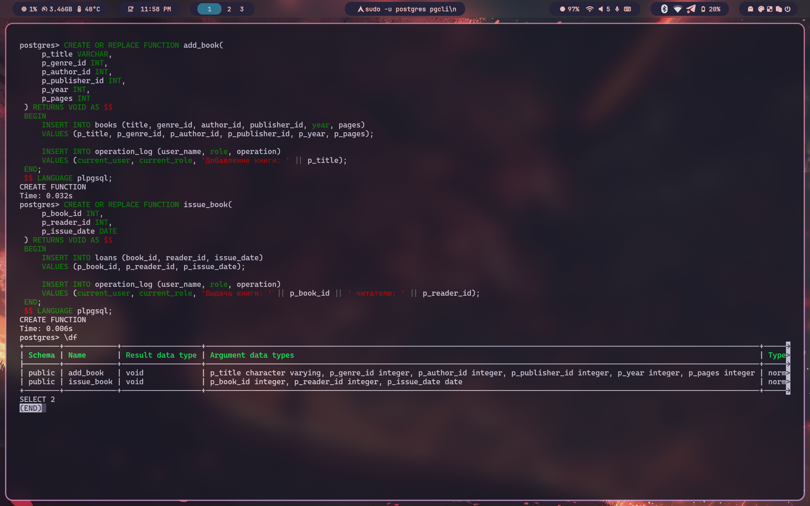
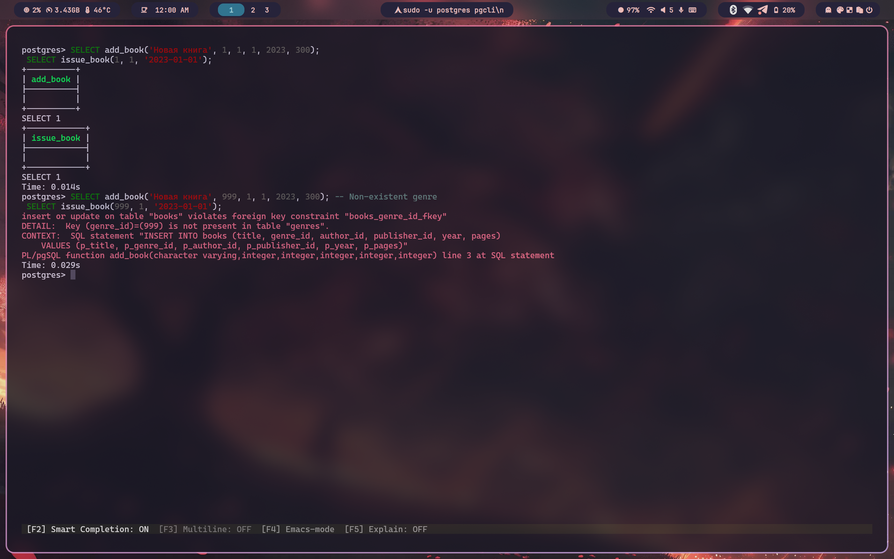

# Практическая работа №9


## Постановка задачи

Разработать реляционную базу данных "Библиотека", предназначенную для хранения информации о книгах, читателях и их взаимодействии с изданиями (выдача книг, возврат, история чтения и пр.). Система должна поддерживать роли пользователей с разными уровнями доступа и протоколировать все действия, изменяющие данные в базе.

### Требования к базе данных:

1. **Структура базы данных:**
   - Таблицы-справочники (например, жанры, авторы, типы изданий).
   - Основные таблицы, использующие справочники (например, книги, читатели, формуляры).
   - Обеспечение ссылочной целостности (внешние ключи).

2. **Ролевой доступ:**
   - **Оператор БД** — наполнение и изменение справочников.
   - **Пользователь БД** — работа с основной функциональностью, с ограничениями по редактированию.
   - **Аналитик** — доступ только к аналитическим запросам, без возможности изменения данных.
   - **Администратор БД** — полный доступ, включая просмотр журнала операций и изменение структуры БД.

3. **Протоколирование действий:**
   - Все действия, изменяющие данные (INSERT, UPDATE, DELETE), выполняемые пользователями любых ролей, фиксируются в журнале операций.

4. **Оптимизация запросов:**
   - Для всех часто используемых запросов созданы индексы.
   - При тестировании использовалась настройка `enable_seqscan = off` для принудительного использования индексов.

5. **Интерфейс взаимодействия:**
   - Разработаны SQL-функции для работы с базой (добавление книги, выдача книги читателю, возврат книги, регистрация читателя и др.).
   - Все функции проверены как на успешные, так и на ошибочные сценарии выполнения.

6. **Аналитика:**
   - Реализована аналитическая функция, формирующая рекомендации по книгам для читателей с учетом их пола, возраста и предпочтений, основанная на статистике прочитанных изданий.

---

## Создадим базу данных
 С помощью этого скрипта создадим нашу базу данных

 ```sql
CREATE TABLE genres (
    id SERIAL PRIMARY KEY,
    name VARCHAR(100) NOT NULL
);

CREATE TABLE authors (
    id SERIAL PRIMARY KEY,
    first_name VARCHAR(50) NOT NULL,
    last_name VARCHAR(50) NOT NULL
);

CREATE TABLE publishers (
    id SERIAL PRIMARY KEY,
    name VARCHAR(100) NOT NULL
);

CREATE TABLE books (
    id SERIAL PRIMARY KEY,
    title VARCHAR(200) NOT NULL,
    genre_id INT REFERENCES genres(id),
    author_id INT REFERENCES authors(id),
    publisher_id INT REFERENCES publishers(id),
    year INT,
    pages INT
);

CREATE TABLE readers (
    id SERIAL PRIMARY KEY,
    first_name VARCHAR(50) NOT NULL,
    last_name VARCHAR(50) NOT NULL,
    birth_date DATE,
    gender CHAR(1) CHECK (gender IN ('M', 'F'))
);

CREATE TABLE loans (
    id SERIAL PRIMARY KEY,
    book_id INT REFERENCES books(id),
    reader_id INT REFERENCES readers(id),
    issue_date DATE NOT NULL,
    return_date DATE
);

CREATE TABLE operation_log (
    id SERIAL PRIMARY KEY,
    user_name VARCHAR(100),
    role VARCHAR(50),
    operation TEXT,
    timestamp TIMESTAMP DEFAULT CURRENT_TIMESTAMP
);
```
Результат выполнения:


---
## Заполним данными
Далее нам необходимо заполнить нашу базу данным, которые мы добавим с помощью скрипта:

```sql
INSERT INTO genres (name) VALUES 
('Фантастика'),
('Детектив'),
('История'),
('Поэзия'),
('Научная литература');

INSERT INTO authors (first_name, last_name) VALUES 
('Иван', 'Ефремов'),
('Агата', 'Кристи'),
('Лев', 'Толстой'),
('Александр', 'Пушкин'),
('Сергей', 'Капица');

INSERT INTO publishers (name) VALUES 
('Эксмо'),
('АСТ'),
('Просвещение'),
('Наука'),
('Питер');

INSERT INTO books (title, genre_id, author_id, publisher_id, year, pages) VALUES 
('Туманность Андромеды', 1, 1, 1, 1957, 320),
('Убийство в Восточном экспрессе', 2, 2, 2, 1934, 256),
('Война и мир', 3, 3, 3, 1869, 1225),
('Евгений Онегин', 4, 4, 4, 1833, 224),
('Жизнь науки', 5, 5, 5, 1980, 300);

INSERT INTO readers (first_name, last_name, birth_date, gender) VALUES 
('Анна', 'Иванова', '1990-05-14', 'F'),
('Дмитрий', 'Смирнов', '1985-11-22', 'M'),
('Екатерина', 'Петрова', '2001-03-03', 'F'),
('Алексей', 'Кузнецов', '1998-07-09', 'M'),
('Мария', 'Соколова', '1975-01-30', 'F');

INSERT INTO loans (book_id, reader_id, issue_date, return_date) VALUES 
(1, 1, '2024-06-01', '2024-06-10'),
(2, 2, '2024-06-05', '2024-06-12'),
(3, 3, '2024-06-08', NULL),
(4, 4, '2024-06-10', '2024-06-20'),
(5, 5, '2024-06-15', NULL);

INSERT INTO operation_log (user_name, role, operation) VALUES 
('admin', 'администратор', 'Добавление жанров'),
('admin', 'администратор', 'Добавление авторов'),
('admin', 'администратор', 'Добавление книг'),
('operator1', 'оператор', 'Регистрация читателя'),
('operator1', 'оператор', 'Выдача книги');

```
Результат выполнения:


## Добавляем роли

```sql
CREATE ROLE operator;
CREATE ROLE user_role;
CREATE ROLE analyst;
CREATE ROLE admin;

GRANT INSERT, UPDATE, DELETE ON genres, authors, publishers TO operator;
GRANT SELECT ON ALL TABLES IN SCHEMA public TO user_role;
GRANT INSERT, UPDATE ON books, readers, loans TO user_role;
GRANT SELECT ON ALL TABLES IN SCHEMA public TO analyst;
GRANT ALL PRIVILEGES ON ALL TABLES IN SCHEMA public TO admin;
```
Результат выполнения:


## Создаём функции

```sql
CREATE OR REPLACE FUNCTION add_book(
    p_title VARCHAR,
    p_genre_id INT,
    p_author_id INT,
    p_publisher_id INT,
    p_year INT,
    p_pages INT
) RETURNS VOID AS $$
BEGIN
    INSERT INTO books (title, genre_id, author_id, publisher_id, year, pages)
    VALUES (p_title, p_genre_id, p_author_id, p_publisher_id, p_year, p_pages);
    
    INSERT INTO operation_log (user_name, role, operation)
    VALUES (current_user, current_role(), 'Добавление книги: ' || p_title);
END;
$$ LANGUAGE plpgsql;

CREATE OR REPLACE FUNCTION issue_book(
    p_book_id INT,
    p_reader_id INT,
    p_issue_date DATE
) RETURNS VOID AS $$
BEGIN
    INSERT INTO loans (book_id, reader_id, issue_date)
    VALUES (p_book_id, p_reader_id, p_issue_date);
    
    INSERT INTO operation_log (user_name, role, operation)
    VALUES (current_user, current_role(), 'Выдача книги: ' || p_book_id || ' читателю: ' || p_reader_id);
END;
$$ LANGUAGE plpgsql;

```
Результат выполнения:



## Протестируем функции
С удачными данными

```sql
SELECT add_book('Новая книга', 1, 1, 1, 2023, 300);
SELECT issue_book(1, 1, '2023-01-01');
```
С неудачными данными
```sql
SELECT add_book('Новая книга', 999, 1, 1, 2023, 300); -- Non-existent genre
SELECT issue_book(999, 1, '2023-01-01');
```
Результат выполнения:


---
## Проиндексируем

```sql
CREATE INDEX idx_books_genre ON books(genre_id);
CREATE INDEX idx_books_author ON books(author_id);
CREATE INDEX idx_books_publisher ON books(publisher_id);
CREATE INDEX idx_loans_book ON loans(book_id);
CREATE INDEX idx_loans_reader ON loans(reader_id);

Результат выполнения:


```

---
## Результаты работы

В процессе разработки были выполнены следующие шаги:

- Спроектирована структура базы данных с учетом нормализации данных и обеспечения целостности.
- Созданы основные справочники (авторы, жанры, издательства и др.).
- Реализованы роли пользователей и соответствующие ограничения на уровне PostgreSQL.
- Разработан журнал операций с автоматической регистрацией всех изменений.
- Созданы и протестированы SQL-функции для всех ключевых операций.
- Проведена проверка функций на граничные случаи: добавление некорректных данных, попытки нарушить ограничения доступа и целостности.
- Выполнена настройка и создание индексов для оптимизации поиска и фильтрации данных.
- Проведена разработка аналитического модуля, предоставляющего персонализированные рекомендации читателям.

---

## Выводы

Разработанная база данных "Библиотека" соответствует поставленным требованиям:

- Обеспечена надежность хранения и связность данных благодаря использованию справочников и внешних ключей.
- Реализована гибкая система ролей, позволяющая разграничить доступ к данным в соответствии с потребностями различных типов пользователей.
- Все операции, влияющие на данные, корректно протоколируются, что позволяет отследить любые изменения в базе.
- Система прошла тестирование на устойчивость к ошибкам и некорректному вводу.
- Оптимизация запросов через индексы и аналитические функции делает систему пригодной для масштабного использования.

База данных готова к эксплуатации и может быть расширена в будущем (например, с добавлением функций бронирования книг, учета штрафов, интеграции с внешними библиотечными системами и т.д.).

---